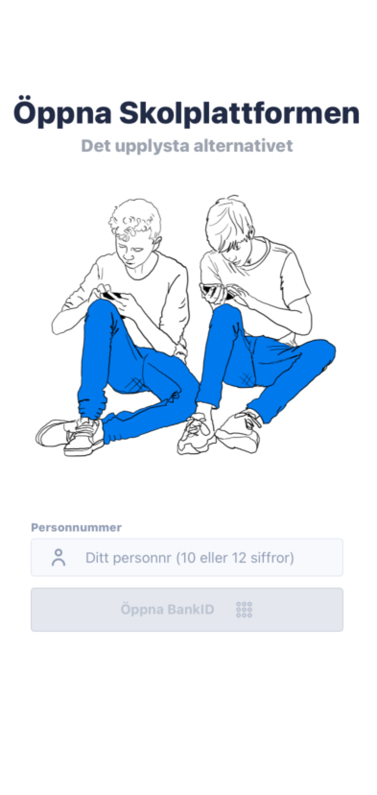
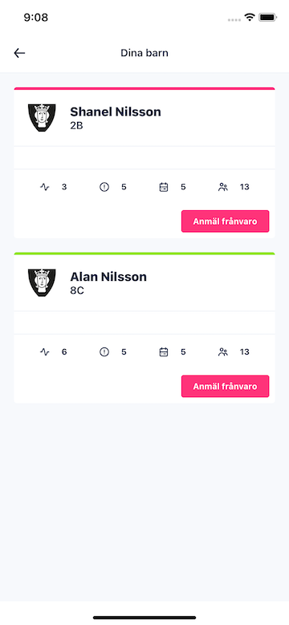

# Öppna skolplattformen

[](LICENSE)
[](https://www.patreon.com/oppnaskolplattformen)

[](https://hosted.weblate.org/engage/skolplattformen/)

We are parents who got fed up with Skolplattformen, the City of Stockholm's school administration platform. We reverse-engineered the platform's API to create a simpler, faster, more consistent, and secure experience for parents and guardians. Give us a ⭐ if you like what we're doing!

If you're simply looking for information about the app, our website can be found at [https://skolplattformen.org/](https://skolplattformen.org/). Check out [the changelog](CHANGELOG.md) to see what new features we've added and what bugs we've squashed.

This is the project's main repository. It contains the source code for both the app and its website. The sources for each can be found under [packages/app](packages/app) and [packages/site](packages/site). The readme files there contain more detailed descriptions.

 

## Contents

* [Architecture](#architecture)
  * [App](#app)
  * [Embedded API](#embedded-api)
* [Development](#development)
* [Contributions](#contributions)
* [Money](#money)
* [Disclaimer](#disclaimer)
* [Contributors](#contributors)
* [License](#license)

## Architecture

The project consists of two main parts: the app and the embedded API.

### App

The central part of the project is the app itself. It's written in [TypeScript](https://www.typescriptlang.org/) using [React Native](https://reactnative.dev/) and [React Native Kitten](https://akveo.github.io/react-native-ui-kitten/).

Our main goal with the app is to make it as fast and easy to use as possible. We're starting small, with more features being added over time.

For more information, check out the [source code](packages/app).

### Embedded API

We decided to encapsulate our API implementation into a separate npm package. By not having to worry about the complex nature of the official API, the app becomes light-weight. It also makes it easier for others to develop their own applications for the Skolplattformen API.

The embedded API has its own project page at [https://github.com/kolplattformen/embedded-api](https://github.com/kolplattformen/embedded-api). To make it easier to use the embedded API in the app, we also created a set of React hooks that are available at [https://github.com/kolplattformen/api-hooks](https://github.com/kolplattformen/api-hooks).

**Pro tip:** If you don't want the API to make requests to the backend, you can enable _fake mode_ to return static data instead. To enable fake mode, log in using the personal identity numbers 12121212121212 or 1212121212.

## Development

To clone and build the project, you first need to install the required dependencies:
```bash
$ sudo apt install git npm
$ npx lerna bootstrap
```

Clone the repo with
```bash
$ git clone https://github.com/kolplattformen/skolplattformen.git
```

The readme files for the [app](packages/app) and [website](packages/site) contain further instructions.

## Contributions

We want this project to become a citizen movement. If you find something you think needs to be fixed, we encourage you to fix the problem yourself and test it out on your machine first. When you're done, create a _pull request_ where you explain why we should incorporate your fix into the project. If you're new to Github, there's a number of excellent guides available, such as [this one on forking projects and making pull requests](https://guides.github.com/activities/forking/).

There are many ways to contribute to the project and we understand that not everyone is a programmer. If you don't know how to program and still want to help, you can also [file an issue](https://github.com/kolplattformen/skolplattformen/issues/new) to let us know when something isn't working properly. We're super duper happy for both issues and pull requests and we try to answer all of them as soon as humanly possible.

Another way to contribute is by helping translate Öppna skolplattformen into a new language or improve on the existing translations. Check us out [on Weblate](https://hosted.weblate.org/engage/skolplattformen/) if this sounds like something you're interested in.

We believe that by working together, we can leverage each other's skills and experiences to improve the project, and ultimately create the best possible experience.

## Money

Even if we definitely stand by our claim that Open Source doesn't mean free, we have now, in fact, made the app free on both App Store and Google Play store. We decided to try a different model of making money to reimburse all our contributors, both coders and other, through voluntary donations on Patreon. Please support us at [https://patreon.com/oppnaskolplattformen](https://patreon.com/oppnaskolplattformen) ❤️

~~We're an open source project and we still charge money for our app. Isn't this a contradiction? No. Open doesn't mean free. We want to continue to maintain this project in a sustainable way, which means that someone needs to pay for the köttbullar for the kids. Our goal is to be able to reimburse all contributions to the project. Of course, you are always welcome to build the app from the source code and do what you want with it!~~

## Disclaimer

This initiative was started by frustrated parents without any affiliation with the City of Stockholm. We just want to find and read our newsletters a little bit easier and register sick-leave a little more conveniently.

If you're offended by this initiative, please don't be — we come in peace.

## Contributors

- [Christian Landgren](https://github.com/irony)
- [Johan Öbrink](https://github.com/JohanObrink)
- [Erik Hellman](https://github.com/ErikHellman)
- [Rickard Natt och Dag](https://github.com/believer)
- [Viktor Sarström](https://github.com/viktorlarsson)
- [Andreas Eriksson](https://github.com/whyer)
- You?

## License

Öppna skolplattformen is copyright 2020-2021 Not Free Beer handelsbolag.

Licensed under the [Apache License, Version 2.0](LICENSE) (the "License"); you may not use Öppna skolplattformen except in compliance with the License. A copy of the License is included with this repository.

Unless required by applicable law or agreed to in writing, software distributed under the License is distributed on an "AS IS" BASIS, WITHOUT WARRANTIES OR CONDITIONS OF ANY KIND, either express or implied. See the [License](LICENSE) for the specific language governing permissions and limitations under the License.
