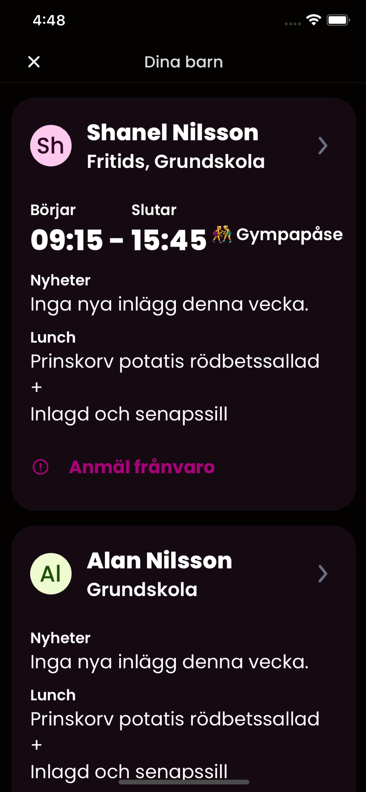

Give us a ⭐ if you appreciate what we do!

# Öppna skolplattformen

[](LICENSE)
[](https://www.patreon.com/oppnaskolplattformen)

[](https://hosted.weblate.org/engage/skolplattformen/)

We are parents who got fed up with Skolplattformen, the City of Stockholm's school administration platform. \ We reverse-engineered the platform's API to create a simpler, faster, more consistent, and secure experience for parents and guardians.

If you're simply looking for information about the app, our website can be found at [https://skolplattformen.org/](https://skolplattformen.org/). \
Check out [the changelog](CHANGELOG.md) to see what new features are added, and a list of fixed bugs.

This main repository for the project contains the source code for both the app and its [website](https://skolplattformen.org/). \
The sources for each can be found under [packages/app](packages/app) and [packages/site](packages/site). \
The respective README files there contain more detailed descriptions.

 

## Contents

* [Architecture](#architecture)
  * [App](#app)
  * [Embedded API](#embedded-api)
* [Development](#development)
* [Contributions](#contributions)
* [Money](#money)
* [Disclaimer](#disclaimer)
* [Contributors](#contributors)
* [License](#license)

## Architecture

The project consists of two main parts: the app and the embedded API.

### App

The central part of the project is the app itself. It is written in [TypeScript](https://www.typescriptlang.org/) using [React Native](https://reactnative.dev/) and [React Native Kitten](https://akveo.github.io/react-native-ui-kitten/).

Our main goal with the app is to make it as fast and easy to use as possible. \
We're starting small, with more features being added over time.

For more information, check out the [source code](packages/app).

### Embedded API

We decided to encapsulate our API implementation into a separate npm package. \
By not having to worry about the complex nature of the official API, the app becomes light-weight. \
It also makes it easier for others to develop their own applications for the Skolplattformen API.

The embedded API has its own project page at [https://github.com/kolplattformen/embedded-api](https://github.com/kolplattformen/embedded-api). \
To make it easier to use the embedded API in the app, we also created a set of React hooks, available at [https://github.com/kolplattformen/api-hooks](https://github.com/kolplattformen/api-hooks).

**Pro tip:** If you don't want the API to make requests to the back-end, you can turn on _fake mode_ to return static data instead. \
Do so by logging in using 12121212121212 or 1212121212 as your personal identity number.

## Development

To clone and build the project, you first need to install the required dependencies:
```bash
$ sudo apt install git npm
$ npx lerna bootstrap
```

Clone the repo with
```bash
$ git clone https://github.com/kolplattformen/skolplattformen.git
```

The README files for the [app](packages/app) and [website](packages/site) contain further instructions.

## Contributions

We want this project to be a citizen movement. If you find something you think needs fixing, we encourage you to do so yourself, and test it out on your machine first. \
Once done, create a _pull request_ where you explain why we should incorporate your fix into the project. \
If you're new to GitHub, there's a number of excellent guides available, such as [this one on forking projects and making pull requests](https://guides.github.com/activities/forking/).

There are many ways to contribute to the project. \
If you don't know how to program and want help, you can [file an issue](https://github.com/kolplattformen/skolplattformen/issues/new) to let us know when something isn't working properly. \
We're super duper happy for both issues and pull requests, and we try to answer all of them as soon as humanly possible.

Another way to contribute is by helping translate Öppna skolplattformen [on Hosted Weblate](https://hosted.weblate.org/engage/skolplattformen/) into a new language, or to improve existing translations.

_Working together leverages available skills and experience in improving the project, ultimately creating the best possible experience_.

## Money

Even if we definitely stand by our claim that libre software doesn't mean gratis, we have now offered it free of charge on both the Apple App Store and on Google Play. With this different model, you can extend your appreciation to all our contributors. Send some köttbullar for the kids through voluntary donations on [https://patreon.com/oppnaskolplattformen](https://patreon.com/oppnaskolplattformen) ❤️.

## Disclaimer

This initiative was started by frustrated parents without any affiliation with the City of Stockholm. \
We just want to find and read newsletters with greater ease, and register sick-leave in a convenient manner.

If you're offended by this initiative, rest assured there is no reason to be — we come in peace.

## Contributors

- [Christian Landgren](https://github.com/irony)
- [Johan Öbrink](https://github.com/JohanObrink)
- [Erik Hellman](https://github.com/ErikHellman)
- [Rickard Natt och Dag](https://github.com/believer)
- [Viktor Sarström](https://github.com/viktorlarsson)
- [Andreas Eriksson](https://github.com/whyer)
- [Kajetan Kazimierczak](https://github.com/kajetan-kazimierczak)
- You?

## License

Öppna skolplattformen is copyright 2020–2021 Not Free Beer AB.

Licensed under the [Apache License, Version 2.0](LICENSE) (the "License"); you may use Öppna skolplattformen in compliance with the License. A copy of the License is included with this repository.

Unless required by applicable law or agreed to in writing, software distributed under the License is distributed on an "AS IS" BASIS, WITHOUT WARRANTIES OR CONDITIONS OF ANY KIND, either express or implied. See the [License](LICENSE) for the specific language governing permissions and limitations under the License.
