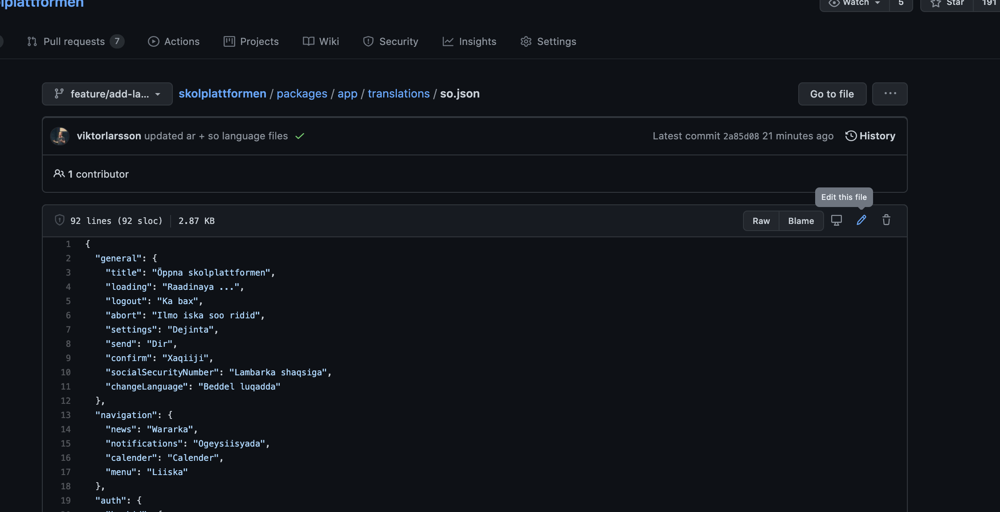
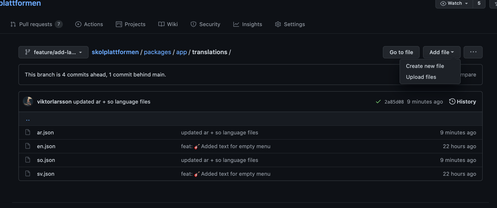
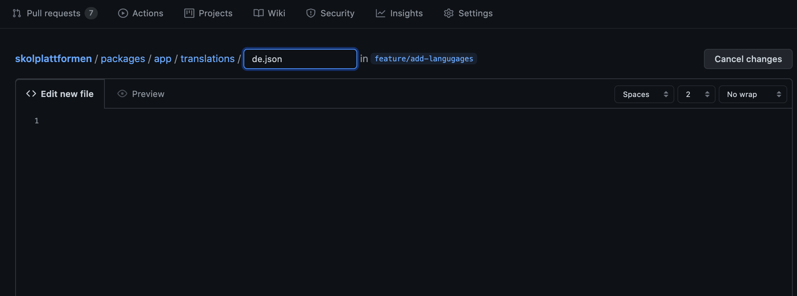

# How to help out with translating Öppna Skolplattformen

## Getting started
You need to create a [Github](https://github.com/join) account prior to doing any changes to the translation

Knowledge regarding the ISO-638-1 code that is for the languages that you know. Read here on [https://en.wikipedia.org/wiki/List_of_ISO_639-1_codes](Wikipedia).


## Edit a already added language

Locate the language that you want to edit 



Then commit and save your changes when you are done.

## Add a new language

If you cant find the language you want to translate to, please go through the following steps

### Create a file in Github



### Name the file




Please locate your language code (639-1) on [https://en.wikipedia.org/wiki/List_of_ISO_639-1_codes](Wikipedia)

Examples

```
German: de.json   
Finnish: fi.json
```

### Adding the translation

Start by copying the contents either 
[swedish](https://github.com/kolplattformen/skolplattformen/blob/feature/add-langugages/packages/app/translations/sv.json), or 
[english](https://github.com/kolplattformen/skolplattformen/blob/feature/add-langugages/packages/app/translations/sv.json) base (or the one that you are most comfortable with) and copy paste the content into the new language that you have created.

